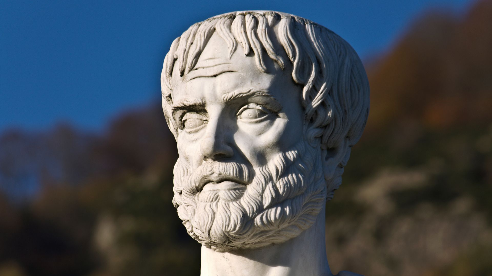
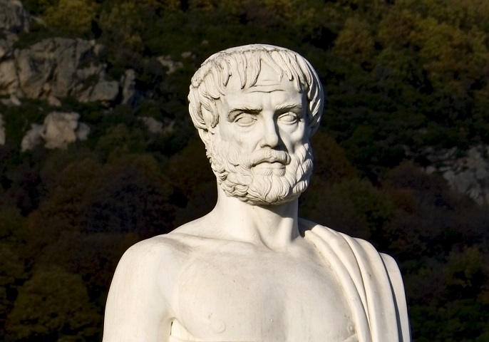

Aristoteles_main

# Aristoteles: Poetik (050802)

**Inhalt**

Die aristotelische Poetik ist das Schlüsselwerk antiker Literatur- und Kunsttheorie und behielt insbesondere ihre dramentheoretische Strahlkraft über viele Jahrhunderte. Sie ist gleichzeitig eine umfangreiche Antwort auf Platons Kunstkritik und rehabilitiert die Dichtkunst als erkenntnisfördernde Praxis gegenüber der Philosophie. Darüberhinaus legt sie ästhetische Grundbegriffe fest, wie etwa Mimesis, Poesis, Drama, Katharsis und Katastrophe, die aus der ästhetischen Theorie nicht wegzudenken sind.

* Moritz Riemann [riemann@philsem.uni-kiel.de](riemann@philsem.uni-kiel.de) 

* Sprechstundentermine im Sommersemester: **Mittwochs 14-15 Uhr**  |  Boschstraße 1, R. 01.001 | **Keine Anmeldung erforderlich** | Nach Absprache auch digital oder telephonisch unter 0431 880 5644

## "Regierungserklärung"

1. Die Teilnahme am Seminar erfordert die vorbereitende, gründliche Lektüre der Texte.
2. Eine regelmäßige und aktive Teilnahme aller Seminarteilnehmenden ist Voraussetzung für ein gelingendes Seminar.
3. Philosophische Seminare leben vom diskursiven Austausch. Nehmt in Euren Diskussionsbeiträgen auf den Text und aufeinander Bezug, lasst einander ausreden und vermeidet lange, abschweifende Exkurse.
4. Meine Sprechsstunde ist offen für alle Anliegen, es ist keine Anmeldung erforderlich.
5. Bevor Ihr eine Email schreibt: Seht im Seminarplan nach, ob die gesuchte Information dort zu finden ist.

## Zuordnung und Prüfungsleistungen

* **PHF-phil-BA2 (Geschichte der Philosophie – Gegenwart):** Ergebnisprotokoll im Umfang von 2-3 Seiten. Das Protokoll soll die wesentlichen Inhalte einer Seminarssitzung ergebnisorientiert und systematisch zusammenfassen. Die Anmeldung zum Protokoll erfolgt zu Beginn der Sitzung. Es ist bis Freitag, 12 Uhr nach der protokollierten Sitzung im OLAT-Teilnehmerordner hochzuladen und dient damit der Rekapitulation zu Beginn der folgenden Sitzung. Beachten Sie die Handreichung zum Erstellen eines Protokolls. Das Protokoll muss am Beginn der folgenden Sitzung kurz (5 Minuten) vorgestellt werden.

* **PHF-phil-BA3 (Einführung in die theoretische Philosophie):** Take-Home-Klausur im Umfang von 5-6 Seiten. Die Aufgabenstellung erfolgt in der letzten Sitzung. **Abgabe: 31.08.2025**

* **PHF-phil-BA5 (Theoretische Philosophie II – Vertiefung):** Hausarbeit im Umfang von 10 Textseiten. Individuelle und eigenständige Themenfindung aus dem Themenbereich des Seminars. Ein persönliches Gespräch mit dem Dozenten in der Sprechstunde zur Vorbereitung ist Voraussetzung für die Annahme der Arbeit. **Abgabe: 31.08.2025**

* **PHF-phil-WP (Philosophische Reflexion und ethische Urteilskraft):** Essay im Umfang von 5-7 Textseiten. Individuelle und eigenständige Themenfindung aus dem Themenbereich des Seminars. Ein persönliches Gespräch mit dem Dozenten (Sprechstunde) zur Vorbereitung ist Voraussetzung für die Annahme der Arbeit. **Abgabe: 31.08.2025**

Beachten Sie die Handreichung zum wissenschaftlichen Arbeiten im Fach Philosophie. Jedes Referat, jede Hausarbeit und jeder Essay sind im Vorfeld in der Sprechstunde abzustimmen. Der Abgabetermin für die schriftlichen Prüfungsleistungen ist der **31.08.2025**. Die Abgabe von THK, Essays und Hausarbeiten erfolgt als Ausdruck, mit Deckblatt und unterschriebener Eigenständigkeitserklärung an der Hauptpforte oder im Briefkasten für Prüfungsleistungen in der LS4. **Eine Abgabe per Email ist nicht ausreichend!**

## Hinweise für das Verfassen von Sitzungsprotokollen

### I. Grundformen und Funktionen

1. Wortprotokoll, Verbalprotokoll – direkte Dokumentation des mündlichen Wortlauts z.B. bei Gerichtsverhandlungen
2. Verlaufsprotokoll, Verhandlungsprotokoll – Protokoll des Gesprächsprozesses. Wie kam es zu Beschlüssen oder Ergebnissen? Wie lauteten die Argumente?
3. Ergebnisprotokoll, Beschlussprotokoll – Fokus auf Ergebnisse. Keine Dokumentation des Gesprächsprozesses.
4. Das wissenschaftliche Protokoll – Anteile des Verlauf- und Ergebnisprotokolls. Schriftliche und systematische Wiedergabe diskursiv erarbeiteten Wissens, die eine gemeinsame Wissensbasis schafft. Funktionen: Dokumentation und Aufbereitung des Wissens, Literaturgrundlage, Kontrolle des Wissensstandes, Üben wissenschaftlichen Formulierens

### II. (Sprachliche) Gestaltung

1. Der Protokollkopf: Name der Hochschule, Institut, Seminartyp, Seminarleitung, Protokollant:in, Semester, Datum.

2. Der Protokolltext: 

    * Der Text ist im Präsens und Indikativ zu verfassen. Bei Bezügen auf den Seminarverlauf - also was eine Person sagte - wird Präteritum gewählt. 
    * Das Protokoll ist in ganzen Sätzen (nicht in Stichpunkten) zu formulieren. 
    * Ergebnisse sollen dargestellt werden, allerdings auch deren diskursiver Zusammenhang berücksichtigt werden. Die namentliche Nennung von Sprecher*innen ist nicht angebracht. 
    * Besonders wichtige Aspekte können markiert oder hervorgehoben werden. Auch sollte das Protokoll sinnvoll durch Überschriften und Zwischenüberschriften (Thema und Unterthemen der Sitzung) strukturiert werden. 
    * Übliche Länge sind zwei bis drei DIN-A 4-Seiten.

3. Der Anhang: Bibliographie der Literatur der Seminarsitzung / Folien auf die Bezug genommen wurde.

4. Textformat: Serifenfont (z.B. Times New Roman) 12pt, Fußnoten 10pt., Zeilenabstand 1,5, Blocksatz, Seitenränder 3cm links, 3cm rechts

### III. Herausforderungen

* Balance zwischen diskursivem Verlauf und Ergebnissen -> Herausarbeitung der (zentralen) Ergebnisse.
* Balance zwischen sprachlicher Verknappung/Abstraktion und Wiedergabe der Beiträge. Bitte keine Umgangssprache verwenden. Auf korrekte Fachlexik achten.
* Das Protokoll vor der Abgabe Korrektur lesen (lassen).
* Formal: Protokollkopf einfügen, Gliedern und Strukturieren, Literaturangaben nicht vergessen, Markierungen einheitlich verwenden. (siehe Checkliste)

### IV. Fünf Schritte bei der Erstellung des Protokolls

1. Vorbereitung. Die zu protokollierende Sitzung sollte gut vorbereitet sein.

2. Rezeption der Seminarsitzung. Die anspruchsvolle Aufgabe, Inhalte zu komprimieren und zu strukturieren ist durch eine Tonaufnahme nicht bewältigt, sondern nur vertagt. Außerdem erfordert die Aufnahme das Einverständis des gesamten Plenums. Hören Sie gut zu und seien Sie gnädig mit sich, wenn Sie nicht die vollen 90 Minuten jeden Satz verstehen.

3. Mitschrift während der Sitzung. Wichtige Inhalte müssen dokumentiert werden – gern auch in Stichpunkten oder unter Verwendung von Symbolen und Verweisen. Es ist nicht leicht zu entscheiden, was wichtig und was weniger wichtig ist. Hier hilft es Ihnen, wenn Sie exzellent auf die Seminarsitzung vorbereitet sind. Achten Sie auf folgende Aspekte:

    * Quantität der Besprechungsdauer – Wie lange wurde ein Aspekt besprochen?
    * Top-down denken. Lässt sich die Sitzung in Themenclustern beschreiben? Wie lässt sich eine Struktur herstellen?
    * Gesamtdiskurs aufzeigen. Welche Aspekte vergangener Sitzungen wurden aufgegriffen?
    * Bilanz ziehen. Offene Fragen nennen.

4. Komprimieren und Reproduzieren. Es bietet sich an, die Mitschrift so schnell wie möglich zu bearbeiten, da die Inhalte dann noch frisch erinnert werden. Ergänzen Sie nun aus dem Gedächtnis oder aus Ihren Materialien wichtige Aspekte ihrer Mitschrift und bringen Sie die Inhalte in eine Struktur (die von der Chronologie des Seminars abweichen kann).

5. Erstellen des Protokolls. Die Stichpunkte und Notizen müssen nun in ganze Sätze und eine kohärente Form gebracht werden. Möglicherweise wird der Text auch nochmals umstrukturiert. Der fertige, korrigierte Text kann auch nochmal anhand der Funktionen des Protokolls überprüft werden. Kann eine fremde Person den Sitzungsverlauf und -inhalte nachvollziehen?

Quelle: Kirsten Schindler: Klausur, Protokoll, Essay. Kleine Texte optimal verfassen, Paderborn 2011.

### V. Checkliste vor der Abgabe

 1. Hat Ihr Protokoll einen Kopf?
 2. Ist Ihr Text einheitlich formatiert, im Blocksatz und unter Berücksichtigung der Seitenränder? Stimmen die Seitenumbrüche? Haben Sie Seitenzahlen angegeben?
 3. Haben Sie die Textgrundlage der Sitzung und weitere Quellen einheitlich und eindeutig bibliographisch nachgewiesen?
 4. Besteht Ihr Text aus ganzen und klar verständlichen Sätzen?
 5. Haben Sie Orthographie und Grammatik korrekturgelesen? Haben Sie Fremdwörter und Fachbegriffe nachgeschlagen und deren korrekte Schreibweise überprüft?
 6. Haben Sie die Sitzungsinhalte gegliedert?
 7. Ist Ihr Text ergebnisorientiert verfasst?
 8. Lassen sich die wichtigsten Inhalte der Sitzung anhand Ihres Textes nachvollziehen? Stellen Sie sich vor, Sie müssten einer Kommiliton:in berichten, die bei der Sitzung fehlte.
 9. Bei digitaler Abgabe: Haben Sie Ihr Dokument als .pdf exportiert?
10. Haben Sie alle Punkte der Checkliste berücksichtigt?
11. Haben Sie Ihr Protokoll auf OLAT in den Abgabeordner geladen?

### VI. Vorstellung des Protokolls in der nächsten Sitzung

* Bereiten Sie Ihr Protokoll so vor, dass Sie zu Beginn der darauffolgenden Sitzung in 5 Minuten die Inhalte der protokollierten Sitzung für die Seminarteilnehmenden zusammenfassen können.

## Der Essay als Prüfungsart in den Bachelor- und Masterstudiengängen Philosophie

### 1. Der philosophische Essay

Mit dem Essay als Prüfungsform stellt sich das Philosophische Seminar der Kieler Universität in eine philosophische Tradition, die in dieser literarischen Form die eigenständige Auseinandersetzung mit
einer Frage und These wagt und einen eigenen Gedanken entfaltet. Der Essay (von frz. *essai*: „Versuch“ >
lat. *exagium*, dt. „wägen“, „Gewicht“) ist ein prägnanter Aufsatz über ein philosophisches Problem, eine
kontrovers diskutierte Fragestellung oder These. Im Unterschied zu einer Hausarbeit, in der eine
sachorientierte und systematische Behandlung eines Themas erwartet wird, kommt es beim Essayschreiben
darauf an, das jeweilige Thema in einem größeren Zusammenhang zu ‚erwägen‘, d.h. zu erörtern, um zu einer eigenen Position zu finden und deutlich Stellung zu beziehen. Der Essay erlaubt stilistisch eine größere Freiheit als die wissenschaftliche Hausarbeit, jedoch handelt es sich nicht um eine persönliche Meinungsäußerung, sondern um eine argumentativ begründete Auseinandersetzung.

Die Tradition des philosophischen Essays geht auf die *Essais* von Michel de Montaigne (1533-1592) zurück und betont die eigene Denkbewegung und das erforschende Suchen eines Standpunktes. Mit der essayistischen Form ist eine besondere Form des Philosophierens verbunden, deren Fokus weniger auf der systematischen Auseinandersetzung liegt, sondern vielmehr in der Darstellung der Denkbewegung und Entfaltung eines Gedankens selbst. Mit Francis Bacon (1561-1626), der das Wort von Montaigne übernommen und ins Englische übertragen hat, wird *Essay* zur Gattungsbezeichnung nicht nur philosophischer, sondern auch literarischer Schriften. Beide Autoren gelten als ´Ahnväter´ der philosophischen Essayistik.

Die semantische Erkundung von *essai/essaier* gibt erste Hinweise auf die Unmittelbarkeit und Erfahrungsorientiertheit der essayistischen Denk- und Schreibweise: Wer essayistisch denkt und schreibt, fängt bei sich, d.h. den eigenen Erfahrungen mit der Welt und mit sich selbst an; sie/er unterzieht dabei die eigenen Sichtweisen, Erfahrungen, Urteile, aber auch das, was an Sichtweisen, Erfahrungen, Urteilen anderer jeweils begegnet, einer denkenden Prüfung oder Erwägung. Wenn es sich bei dem Geschriebenen noch dazu um Versuche handelt, so sind die damit verbundenen Wissens-, Erkenntnis- oder Wahrheitsansprüche anscheinend deutlich herabgestimmt. Zugleich bedeutet die essayistische Denkweise aber auch die Erprobung einer Perspektive auf eine bestimmte Sache (seien es Dinge, Sachverhalte/Phänomene, Situationen, Ereignisse), um sie zu erschließen und zu beurteilen.

Eine Hochzeit der philosophischen Essayistik lag in der europäischen Aufklärung des 18. Jahrhunderts. Die Zeit der kritischen Emanzipation von tradierten Herrschaftsverhältnissen hat namhaften Essayisten wie Voltaire in Frankreich, David Hume in England und Gotthold Ephraim Lessing in Deutschland hervorgebracht.

 
Das Essayschreiben erfordert in besonderer Weise kritisches Selbstdenken und die Entwicklung einer eigenständigen Argumentation. Auch wenn die Rückbeziehung auf persönliche bzw. alltägliche Erfahrungen dabei ein wesentlicher Bestandteil der Essayistik ist, **so liegt im Philosophiestudium der Akzent beim Essayschreiben doch deutlich auf der gedanklichen Auseinandersetzung mit einer philosophischen Problemstellung/Kontroverse oder einer philosophischen Position oder einem philosophischen Begriff.** In diesem Kontext kommt es darauf an, sich philosophische Texte methodisch erschließen zu können, um sie angemessen zu verstehen und auszulegen. Mit Hans Georg Gadamer lässt sich der Vorgang des Verstehens als ein Bemühen beschreiben, mit dem Text ´ins Gespräch zu kommen´, d.h. den historischen Horizont des Textes mit dem eigenen „Verstehenshorizont der Gegenwart“, seinen impliziten Maßstäben und legitimen Vorurteilen zu „verschmelzen“.[^1] Eine gute Vorbereitung für diese **hermeneutische Herangehensweise beim Essayschreiben** ist es, sich vor der Lektüre die eigenen Erwartungen an den Text bzw. an das Thema und das eigene Vorverständnis zu vergegenwärtigen.[^2] Wie bei einem Gespräch mit einem unbekannten Menschen, kann dies dazu beitragen, das Gefühl der Fremdheit zu überwinden und dem Gelesenen gegenüber aufgeschlossen zu bleiben – also: aufmerksam ´zuzuhören´. 

[^1]: H.-G. Gadamer: *Wahrheit und Methode. Grundzüge einer philosophischen Hermeneutik.* Tübingen 1960. 6. Aufl. 1990. S.289f. 

[^2]: Vgl. Thomas Rentsch/Johannes Rohbeck: *Essays schreiben – aber mit Methode.* In: Jahrbuch für Didaktik der Philosophie und Ethik 8 (2007). S. 75-81. hier S.78f.

**Literaturhinweise**

Montaigne, Michel de: *Essais*. Übers. v. Hans Stilett. Frankfurt a.M. 2001.

Bacon, Francis: *Essays oder praktische und moralische Ratschläge*. Übers. v.  Elisabeth Schücking. Hrsg. v. Levin Schücking. Stuttgart 2011.

Konersmann, Ralf: *Essay*. in: Ders.: Wörterbuch der Unruhe. Frankfurt a. M. 2017. S.49-55.

Černy, Lothar: *Essay*, in: Historisches Wörterbuch der Philosophie. Hrsg. v. Joachim Ritter, Karlfried Gründer und Gottfried Gabriel. Basel 1971-2007. Bd. 2, Sp.746-749.

Schärf, Christian: *Geschichte des Essays. Von Montaigne bis Adorno.* Göttingen 1999.

### 2. Der Essay als Prüfungsart in den Bachelor- und Masterstudiengängen Philosophie

Der Essay kann in den BA-Wahlpflichtmodulen BA7 und BA8 als eine unter vier Prüfungsarten gewählt werden (Umfang: ca. 10 Seiten); im Modul BA9 ist er neben einer Hausarbeit als weitere Prüfungsart vorgeschrieben. – In den Masterstudiengängen Philosophie ist der Essay verpflichtende Prüfungsart in den Modulen MAA1 bzw. MAE2. 
Die Form des Essays als Prüfungsleistung ist offener als bei einer Hausarbeit. Zur Form gehören die Zitation und eine Bibliographie, wie es auch die wissenschaftliche Hausarbeit fordert. Jedoch sind strenge Strukturierungen mit einem Inhaltsverzeichnis und einer Kapitelstruktur nicht erforderlich. Selbstverständlich gehört zur Prüfungsleistung des Essays ebenso ein Titelblatt wie die aktuelle Eigenständigkeitserklärung. Die offenere Form liegt in größerer sprachlicher und stilistischer Freiheit. Die eigene Perspektive auf eine philosophische Frage oder einen philosophischen Gedanken darf ausgeführt werden, ohne dabei reine Meinungsäußerung zu sein. Es darf mit Beispielen zur Veranschaulichung und Sprachbildern, Metaphern, Fragen gearbeitet werden. Dabei sollte jedoch eine erkennbare Ordnung der Gedanken, d.h. nachvollziehbare Gedankengänge und die erforderliche logische Konsistenz nicht vernachlässigt werden. Ziel ist es einen Standpunkt zu er- und begründen und eine kritische Reflexion eines philosophischen Gegenstandes vorzunehmen.
Es bestehen verschiedene Möglichkeiten, einen Essay zu verfassen. Jonas Pfister[^3] unterscheidet drei Formen des studentischen Essays: 1) den *kritischen* Essay, der eine kritische Prüfung einer philosophischen These vornimmt; 2) den *problemlösenden* Essay, der die Lösung eines philosophischen Problems versucht, und 3) den *urteilenden* Essay, der die Entscheidung eines philosophischen Streits versucht. Jay F. Rosenberg[^4] erläutert wie in einem Essay eine *begründete Verteidigung einer These* erfolgt.

**Achtung:** Das Thema des Essays ist in der Regel im Rahmen des Seminarhorizonts frei gewählt, aber stets mit den Dozent*innen abzustimmen! Das gleiche gilt für etwaige spezifischen Anforderungen des Essays als Prüfungsleistung, die von der jeweiligen Lehrperson festgelegt werden. Diese können von den hier formulierten Anforderungen abweichen.

**Hinweise zum Essayschreiben** s. Lektion zum Essay im **E-Learning Kurs** *Wissenschaftliches Arbeiten im Fach Philosophie*, 3.6/Lektion 13, zu finden im OLAT-Kurs der [Schreibwerkstatt Philosophie](https://lms.uni-kiel.de/auth/RepositoryEntry/4346544132/CourseNode/104073014363120)

## Hinweise zum Verfassen von Hausarbeiten

[Ausführliche Hinweise hier](https://liascript.github.io/course/?https://raw.githubusercontent.com/Philosophie-Lehre-Moritz-Riemann/Hausarbeit/refs/heads/main/Hausarbeit_main.md)

[^3]: Vgl. Pfister, Jonas: *Werkzeuge des Philosophierens*. S.246-250.

[^4]: Vgl. Rosenberg, Jay F.: *Philosophieren. Ein Handbuch für Anfänger*. Frankfurt a. M. 2009. S.81.
## Semesterplan

| **28.04.2025** | **Eröffnung, Organisatorisches, Lektüre Kapitel 1--3** | **Protokoll** |
|------------|------------------------------|---------|
| 05.05.2025 |  Lektüre Kapitel 4--6: Ursprung und Arten der Dichtung | Aaron Kreuer |
| 12.05.2025 | Lektüre Kapitel 7--10: Aufbau und Mythos| Laura Pohlmann |
| 19.05.2025 | Kapitel 11--13: Peripetie, Anagnorisis, Pathos| Tarja Hansen |
| 26.05.2025 |Kapitel 14: Eleos und Phobos; bis hierhin Lektüre der Troerinnen von Euripides| Julius Schrader |
| 02.06.2025 | Kapitel 15: Charaktere; Ergänzung aus Theophrast| Leonie Loock |
| 09.06.2025| **Keine Sitzung: Pfingsten**| -- |
| 16.06.2025 | Kapitel 16--18: Arten der Wiedererkennung, Epos und Drama| Alina Haigermoser |
| 23.06.2025 | Kapitel 19--22: Sprache und Rhetorik; Bis hierhin Lektüre der Troerinnen von Seneca | -- |
| 30.06.2025 |Kapitel 23-25: Gute Dichtung -- Schlechte Dichtung| -- |
| 07.07.2025| **Abschlussdiskussion** | -- |

**Prüfungszeitraum des aktuellen Semesters**:
14.07. - 26.07.2025

**2. Prüfungszeitraum**:
06.10. - 18.10.2025

**Termine für die Anmeldung zum 1. Prüfungszeitraum (1. PZ)**

* Beginn: Montag 2.06.2025
* Ende: Sonntag 29.06.2025

**Termine für die Anmeldung  zum 2. Prüfungszeitraum (2. PZ)**

* Beginn: 25.08.2025
* Ende: 21.09.2025

## 1. Sitzung am 28.04.2025

 **Allgemeine Informationen**

- **Name:** Aristoteles  

- **Lebensdaten:** 384 v. Chr. – 322 v. Chr.  

- **Geburtsort:** Stageira, Griechenland  

- **Beruf:** Philosoph, Wissenschaftler, Lehrer  

- **Schule:** Gründer des Peripatos (Lyzeums) in Athen  

### **Philosophische Ansätze**

Aristoteles gilt als einer der bedeutendsten Philosophen der Antike und prägte zahlreiche Disziplinen:

- **Metaphysik:** Konkrete Einzeldinge sind die Substanzen der Wirklichkeit; später ergänzte er dies durch die Lehre, dass die Form die Substanz ist.

- **Ethik:** Ziel des Lebens ist das Glück (*eudaimonia*), erreichbar durch Verstandes- und Charaktertugenden sowie den richtigen Umgang mit Begierden und Emotionen.

- **Staatslehre:** Der Staat ist Voraussetzung für menschliches Glück; Aristoteles entwickelte eine Staatsformenlehre, die lange Zeit maßgeblich war.

- **Dichtungstheorie:** Die Funktion der Tragödie liegt in der Erzeugung von Furcht und Mitleid, um eine Reinigung (*Katharsis*) zu bewirken.

### **Aristoteles' Denken**

Aristoteles unterteilte Wissen in verschiedene Bereiche:

-  **Theoretische Wissenschaften:** Naturwissenschaften, Mathematik, Ontologie, Theologie und Logik.

-  **Praktische Wissenschaften:** Ethik, Politik und Rhetorik mit dem Ziel des guten Handelns.

-  **Produktive Wissenschaften:** Kunst, Landwirtschaft und Medizin mit dem Ziel des Herstellens.

**Leben und Wirken**

- Aristoteles wurde in Stageira geboren und erhielt seine Ausbildung an Platons Akademie in Athen, wo er 20 Jahre blieb.  

- Nach Platons Tod verließ er Athen und wurde Lehrer von Alexander dem Großen.  

- Er gründete später das Lyzeum in Athen, wo er etwa 12 Jahre lehrte und forschte. Seine Schule wurde auch "Peripatos" genannt, da er oft beim Gehen unterrichtete.

**Werke**

Aristoteles hinterließ ein umfangreiches literarisches Werk:

- Zu seinen bekanntesten Schriften zählen die *Metaphysik*, *Nikomachische Ethik*, *Politik* und *Poetik*.

**Tod**

Aristoteles starb 322 v. Chr. eines natürlichen Todes auf dem Land, nachdem er wegen Gotteslästerung angeklagt worden war und Athen verlassen musste.

## Die wichtigsten Werke von Aristoteles

**Logik und Wissenschaftstheorie**

- **Organon**: Sammlung logischer Schriften, die die Grundlagen der formalen Logik und Dialektik behandeln. Dazu gehören:

  - *Kategorien* (Cat.)

  - *De interpretatione* (Int.)

  - *Analytica priora* und *Analytica posteriora* (An. pr., An. post.)

  - *Topik* (Top.)

  - *Sophistische Widerlegungen* (Soph. el.).

**Theoretische Wissenschaften**

- **Metaphysik**: Untersuchung der Prinzipien des Seins und der Wirklichkeit, oft als Ontologie bezeichnet.

- **Physik**: Schriften zur Naturphilosophie, die sich mit Veränderung, Materie und Form beschäftigen.

- **De anima**: Seelenlehre, die die Seele als Form des Körpers beschreibt.

**Praktische Wissenschaften**

- **Nikomachische Ethik**: Analysen über Tugend, Glück und das gute Leben.

- **Politik**: Untersuchung der besten Staatsformen und des menschlichen Zusammenlebens.

- **Eudemische Ethik**: Ergänzung zur Nikomachischen Ethik mit ähnlichen Themen.

**Poietische Wissenschaften**

- **Rhetorik**: Kunst der Überzeugung und Argumentation.

- **Poetik**: Theorie der Dichtung, insbesondere der Tragödie und ihrer Wirkung (*Katharsis*).

**Naturwissenschaftliche Werke**

- **Historia animalium**: Zoologische Studien über Tiere und ihre Eigenschaften.

- **De generatione et corruptione**: Untersuchungen über Entstehung und Vergehen.

- **De partibus animalium** und **De generatione animalium**: Anatomische und biologische Studien.
Diese Werke bilden die Grundlage für zahlreiche Disziplinen wie Philosophie, Naturwissenschaften und Politik. Sie sind bis heute einflussreich in der akademischen Welt.

## Zum Nachforschen

### Übersetzungen mit Kommentar

- Deutsch
    - Poetik. Übersetzt und erläutert von A. Schmitt, Berlin/Darmstadt 2008.
- Englisch
    - Bywater, I. 1909: Aristotle on the Art of Poetry (A Revised Text with Critical Introduction,
      Translation and Commentary), Oxford.
    - Else, G. 1957: Aristotle’s Poetics. The Argument, Cambridge/MA.
    - Halliwell, S. 1987: The Poetics of Aristotle, London.
    - Janko, R. 1987: Aristotle, Poetics I, with the Tractatus Coislinianus, a hypothetical recon-
      struction of Poetics II, the fragments of the On poets, Indianapolis/Cambridge.
    - Whalley, G. 1997: Aristotle’s Poetics, Montreal.
- Französisch
    - Destrée, P. (in Vorbereitung): Aristote. La Poétique, Paris.
    - Dupont-Roc, R./Lallot, J. 1980: Aristote, La Poétique. Texte, traduction, notes, Paris.

### Ausgewählte Sekundärliteratur

- Bibliographien und Hilfsmittel

  - Bonitz, H. (Hrsg.) 21870: Index Aristotelicus, Berlin (Band V der Gesamtausgabe der Akademie).

  - Denooz, J. 1988: Aristote, Poetica. Index verborum. Liste de fréquence, Lüttich.

  - Heath, M. 2001: Aristotle Poetics: a bibliography.

  - Höffe, O. (Hrsg.) 2005: Aristoteles-Lexikon, Stuttgart. 
  
      - 2006: Arstoteles, München (zur Poetik: 69–76).
      
      - 2009: Aristoteles: Die Hauptwerke. Ein Lesebuch, Tübingen.
      
      - 2009: Aristoteles Poetik, Berlin.

  - Lobel, E. 1933: The Greek Manuscripts of Aristotle’s Poetics, Oxford.

  - Moraitou, D. 1994: Die Äußerungen des Aristoteles über Dichter und Dichtung außerhalb der Poetik, Stuttgart, Leipzig.

  - Schrier, O. J. 1998: The Poetics of Aristotle and the Tractatus Coislinianus. A bibliography from about 900 till 1996, Leiden u. a.

  - Wartelle, A. 1985: Lexique de la Poétique d’Aristote, Paris.

- Kommentare und Abhandlungen zur Poetik

  - Andersen, Ø./Haarberg, J. (Hrsg.) 2001: Making Sense of Aristotle: Essays in Poetics, London.

  - Luserke, M. (Hrsg.) 1991: Die Aristotelische Katharsis. Dokumente ihrer Deutung im 19. und 20. Jahrhundert, Hildesheim u. a.

  - Rorty, A. O. (Hrsg.) 1992: Essays on Aristotle’s Poetics, Princeton. 

  - Seidensticker, B./Vöhler, M. (Hrsg.) 2007: Katharsiskonzeptionen vor Aristoteles, Berlin.

**Sonstige Sekundärliteratur**

  - Auerbach, E. 102001: Mimesis. Dargestellte Wirklichkeit in der abendländischen Literatur, Tübingen.

  - Belfiore, E. 1992: Tragic Pleasures. Aristotle on Plot and Emotion, Princeton.

  - Bernays, J. 1880: Zwei Abhandlungen über die aristotelische Theorie des Drama: I. Grundzüge der verlorenen Abhandlung des Aristoteles über Wirkung der Tragödie; II. Ergänzung zu Aristoteles’ Poetik, Berlin.

  - Bremer, J. M. 1969: Hamartia. Tragic Error in the Poetics of Aristotle and in Greek Tragedy, Amsterdam.

  - Cessi, V. 1987: Erkennen und Handeln in der Theorie des Tragischen bei Aristoteles, Frankfurt/M.

  - Davis, M. 1999: The Poetry of Philosophy. On Aristotle’s Poetics, South Bend.

  - Diaz-Tejera, A. 1984: La poesía como causalidad en la Poética de Aristóteles, in: Emerita 52, 271–286.

  - Dilcher, R. 1996: Furcht und Mitleid! Zu Lessings Ehrenrettung, in: Antike und Abendland 42, 85–102.

  - Else, G. 1986: Plato and Aristotle on Poetry, Chapel Hill.

  - Erler, M. 1997: Ideal und Wirklichkeit. Die Rahmengespräche des Timaios und Kritias und Aristoteles’ Poetik, in: T. B. L. Calvo (Hrsg.): Interpreting the Timaeus – Critias. Granada/Madrid, 83–88.

  - Ette, W. 2003: Die Aufhebung der Zeit in das Schicksal. Zur „Poetik“ des Aristoteles, Berlin.
  
  - Fendt, G. 2007: Love Song for the Life of the Mind. An Essay on the Purpose of Comedy, Washington.

  - Finsler, G. 1900: Platon und die Aristotelische Poetik, Leipzig.

  - Flashar, H. 1974: Aristoteles und Brecht, in: Poetica 6, 17–37.
     
    – 1984: Die Poetik des Aristoteles und die griechische Tragödie, in: Poetica 16, 1–23.

  - Fortenbaugh, W. W. 1975: Aristotle on Emotion, Londonn.

  - Freeland, C. A. 1996: Aristotle’s Poetics in Relation to the Ethical Treatises, in: W. Wians (Hrsg.): Aristotle’s Philosophical Development. Problems and Prospects, Lanham, 327–245.

  - Fuhrmann, M. 2003: Die Dichtungstheorie der Antike. Aristoteles, Horaz, „Longin“. Eine Einführung, überarbeitete Neuauflage, Düsseldorf.

  - Golden, L. 1992: Aristotle on Tragic and Comic Mimesis, Atlanta.

  - Hall, E. 1996: Is there a Polis in Aristotle’s Poetics? In: M. S. Silk (Hrsg.): Tragedy and the Tragic. Greek Theatre and Beyond. Oxford, 295–309.

  - Hamburger, Käte: Die Logik der Dichtung. München 1987.

  - Halliwell, S. 1998: Aristotle’s Poetics, Chicago.
  
    - 2002: The Aesthetics of Mimesis. Ancient Texts and Modern Problems, Princeton.
    
    - 2003: Aristoteles und die Geschichte der Ästhetik, in: T. Buchheim/H. Flashar/R. A. H. King (Hrsg.): Kann man heute noch etwas anfangen mit Aristoteles? Hamburg, 165–183.

  - Heath, M. 1991: The Universality of Poetry in Aristotle’s Poetics, in: Classical Quarterly, New Series 41, 389–402.

  - Held, G. F. 1995: Aristotle’s Teleological Theory of Tragedy and Epic, Heidelberg.
  
  - Höffe, O. 2001: Durch Leiden lernen. Ein philosophischer Blick auf die antike Tragödie, in: Deutsche Zeitschrift für Philosophie 3, 331–351.

  - Horn, H. J. 1975: Zur Begründung des Vorrangs der praxis vor dem êthos in der aristotelischen Tragödientheorie, in: Hermes 103, 292–299.
  
  - Husain, M. 2002: Ontology and the Art of Tragedy. An Approach to Aristotle’s Poetics, Albany.
  
  - Jung, Werner: Von der Mimesis zur Simulation. Eine Einführung in die Geschichte der Ästhetik. Hamburg 1995.

  - Kafka, Gustav: Aristoteles. München 1922.

  - Kannicht, R. 1976: Handlung als Grundbegriff der aristotelischen Theorie des Dramas, in: Poetica 8, 326–336.

  - Köhnken, A. 1990: Terminologische Probleme in der Poetik des Aristoteles, in: Hermes 118, 129–149.

  - Lienhard, M. K. 1950: Zur Entstehung und Geschichte von Aristoteles’ Poetik, Zürich.

  - Manns, P.: Die Lehre des Aristoteles von der tragischen Katharsis und Hamartia. Karlsruhe und Leipzig 1883.

  - Maróth, M. 1993: Die Poetik und Physik des Aristoteles, in: Acta Antiqua Academiae Scientiarum Hungaricae 34, 95–101.

  - Neschke, A. 1980: Die Poetik des Aristoteles. Textstruktur und Textbedeutung. 1: Interpretationen; 2: Analysen, Frankfurt/M.

  - Nussbaum, M. 1989: Luck and the Tragic Emotions, in: Dies.: The Fragility of Goodness. Cambridge/MA, 378–394.

  - Otte, H. 1928: Neue Beiträge zur aristotelischen Begriffsbestimmung der Tragödie, Berlin.

  - Petersen, J. H. 1992: „Mimesis“ versus „Nachahmung“. Die Poetik des Aristoteles – nochmals neu gelesen, in: Arcadia 27, 3–46.

  - Raumer, F. v. 1831: Über die Poetik des Aristoteles, Berlin.

  - Rapp, Christof: Aristoteles zur Einführung. 6. erw. Auflage, Junius 2020.

  - Rapp, Christof und  Corcilius, Klaus: Aristoteles Handbuch. Leben - Werk - Wirkung, Springer 2021.

  - Schmitt, A. 1994: Aristoteles und die Moral der Tragödie, in: A. Bierl, P. v. Möllendorff (Hrsg.): Orchestra. Drama, Mythos, Bühne. Festschrift für Hellmut Flashar anläßlich seines 65. Geburtstages, Stuttgart, Leipzig, 331–343.

    -  1998: Mimesis bei Aristoteles und in den Poetikkommentaren und Poetiken der Renaissance, in: G. Neumann/A. Kablitz (Hrsg.): Mimesis und Simulation. München, 17–53.
    
    - 2003: Die Literatur und ihr Gegenstand in der Poetik des Aristoteles, in: T. Buchheim/H. Flashar/R. A. H. King (Hrsg.): Kann man heute noch etwas anfangen mit Aristoteles? Hamburg, 184–219.

  - Schütrumpf, E. 1970: Die Bedeutung des Wortes êthos in der Poetik des Aristoteles, München
  
  - Titzmann, Michael: Poetik, in: Literatur Lexikon. ( Hg.) Walther Killy. Bd. 14. Gütersloh, München 1993. S. 216-222.

  - Utitz, Emil: Bemerkungen zur altgriechischen Kunsttheorie. Berlin 1959. ( = Deutsche Akademie der Wissenschaften, Schriften der Sektion für Altertumswiss. 18).

  - Verweyen,Theodor und Witting, Gunther: Artikel „Grundbegriffe der Poetik“, in: Rolf Günter Renner und Engelbert Habekost (Hg.): Lexikon literaturtheoretischer Werke. Stuttgart 1995. S. 164f.

  - Volk, Ulrich: Der poetologische Diskurs der Gegenwart. Untersuchungen zum zeitgenössischen Verständnis von Poetik, dargestellt an ausgewählten Beispielen der Frankfurter Stiftungsgastdozentur Poetik. Frankfurt/M. u.a. 2003.

  - Zierl, A. 1994: Affekte in der Tragödie. Orestie, Oidipus Tyrannos und die Poetik des Aristoteles, Berlin.

### Aristoteles im Netz

- Stanford Encyclopedia of Philosophy: [Aristotle](https://plato.stanford.edu/entries/aristotle/)

- Internet Encyclopedia of Philosophy: [Aristotle](https://iep.utm.edu/aristotle/)

- [Aristotle Foundation for Public Policy](https://aristotlefoundation.org)

- Freie Universität Berlin: [Aristoteles Zentrum](https://www.geisteswissenschaften.fu-berlin.de/we02/griechisch/graezistik/aristotelismuszentrum/index.html)

- Universität Heidelberg [Aristoteles Heute](https://www.ub.uni-heidelberg.de/fachinfo/philosophie/aristoteles/)

- Treffpunkt Philosophie: [Aristoteles – Vater der modernen Wissenschaft](https://treffpunkt-philosophie.de/aristoteles-vater-der-modernen-wissenschaft/)

- Philosophie Magazin: [Lexikon der Philosophie](https://www.philomag.de/philosophen/aristoteles)

### Aristoteles zum Anhören

- RadioWissen: [Aristoteles als Wegweiser](https://podcasts.apple.com/de/podcast/radiowissen/id257719552?i=1000464712363)

- Durchblick Philosophie: [Aristoteles Denken macht glücklich](https://podcasts.apple.com/de/podcast/durchblick-philosophie/id1497307279?i=1000508404306)

### Unterstützung bei der Arbeit mit Antiken Texten

* [Griechisches Alphabet](https://de.wikipedia.org/wiki/Griechisches_Alphabet)
* [Perseus Projekt](https://www.perseus.tufts.edu/hopper/) Digitales Verzeichnis altgriechischer Texte und englischer Übersetzungen mit Zugriff auf den LSJ
* [Gesellschaft für antike Philosophie](https://ganph.de/)

## 2. Sitzung am 05.05.2025

* Rekapitulation Kapitel 1 und 2

> Bildet drei Gruppen und untersucht das Euch zugewiesene Kapitel auf Schlüsselbegriffe und Charakteristika der Dichtkunst. Stellt die Ergebnisse anschließend kurz im Plenum vor. Ihr habt 20 Minuten Zeit für die Gruppendiskussion.

* Gruppe 1: Kapitel 3 + Kapitel 4, S. 13 dritter Absatz (...Hymnen und Preislieder)

* Gruppe 2: Kapitel 4 (Aus vorhomerischer Zeit...) und Kapitel 5

* Gruppe 3: Kapitel 6

### Protokoll von Aaron Kreuer

**Themen:**

1. Rekapitulation von Kapitel 1 und 2
2. Ergebnissammlung: Gruppenarbeit zu Textabschnitten
   
   - Kapitel 3 und Kapitel 4, S. 13 dritter Absatz („Hymnen und Preislieder)
   - Kapitel 4 (aus vorhomerischer Zeit…) und Kapitel 5
   - Kapitel 6
     
**1. Rekapitulation von Kapitel 1 und 2**

Aristoteles eröffnet seine Poetik mit der These, dass alle Dichtkunst die *Nachahmung*
(griech. *Mimesis*)[^1] praktiziert. Ferner unterscheidet er die Dichtung in ihre
unterschiedlichen Formen, welche sich auf die Dithyrambendichtung (Chorlyrik), Epik,
Dramatik, den Tanz und das Flöten- und Zitterspiel beschränken. Die Dramatik lässt sich
zudem in zwei verschiedene Poetikgattungen aufteilen: Die Komödie und die Tragödie.
Es stand auch die dreiteilige Dichtungseinteilung zum Diskurs doch diese dreiteilige
Einteilung in Lyrik, Epik (Prosa) und die dramatische Dichtung entwickelte sich erst im
Verlauf des 18. Jahrhunderts. Bei Aristoteles finden wir zu seiner Zeit wiederum eine
ausdifferenziertere Variante vor. Die Nachahmung vollzieht sich in jeder Dichtung auf
eine bestimmte Art und Weise, und zwar ist ihr Ziel das Darstellen des durchschnittlichen
Lebens in all seinen Fassetten. Hierbei liegt ein besonderes Augenmerk auf dem
menschlichen Charakter, wobei die Charakterentwicklung besonders einschlägig ist. Es
ist jedoch wichtig festzuhalten, dass eine Unterscheidung bereits im Nachahmen der
Menschen stattfindet. So ahmt auf der einen Seite die Tragödie den besseren Menschen
nach, der an seiner Umwelt und den ihn umgebenden äußeren Umständen scheitert und
somit, als Protagonist eines tragischen Helden zugrunde geht. Dem gegenüber steht die
Komödie, die den schlechteren Menschen lustig darstellt, welcher als normaler Mensch
an seiner selbst scheitert. Die Tragödiendichtung nimmt hierbei die höchste Stellung ein
und ist für die griechische Kultur mit Dichtern wie Sophokles die wichtigste und gängigste Form ihrer Zeit. Die Unterscheidungsmerkmale der Dichtungen lassen sich
nicht nur in den Charakteren und Handlungssträngen wiederfinden, sondern auch im
Rhythmus, der Sprache und der Melodie. So besitzt zum Beispiel das Flöten- und
Zitterspiel keine Sprache, der Tanz nur den Rhythmus, doch manche weisen alle drei in
unterschiedlicher Gewichtung auf. Auch das Versmaß macht einen Unterschied zwischen
tragischer Dichtung und Epik aus, es herrscht eine Strenge der griechischen Metrik und
der Hexameter ist das festgelegte Versmaß des Epos.

**2. Ergebnissammlung: Gruppenarbeit**

*Kapitel 3 + Kapitel 4, S. 13 dritter Absatz („Hymnen und Preislieder)*

Im folgenden Abschnitt bezieht der Autor sich erneut auf den Schlüsselbegriff der
Nachahmung (griech. Mimesis), doch eröffnet er eine Unterscheidung der verschiedenen
Vortragsweisen der Handlungen: „Die Nachahmung überhaupt läßt [sic] also, wie wir zu
Anfang sagten, nach diesen drei Gesichtspunkten Unterschiede erkennen: nach den
Mitteln, nach den Gegenständen und der Art und Weise“[^2]. Gegenübergestellt wird der
Begriff des Nacherzählens gegen den des Zeigens. Es ist eine Unterscheidung in
verschiedene Erzählertypen, wobei es sich beim Nacherzählen als ein Mittel der Sprache
in dritter Person und beim Zeigen um die erste Person handelt, welche mehr als nur die
Sprache nämlich sprachliche Stilmittel, Figuren, Argumente und auch Sprecherwechsel
erfordert. Daraufhin unterteilt Aristoteles die Dichtkunst in zwei Ursachen der Dichtung,
welche natürlich dem Hang zur Nachahmung angeboren seien: „Das Lernen bereitet nicht
nur den Philosophen größtes Vergnügen, sondern ähnlicher Weise auch den übrigen
Menschen […]“[^3]. Der Autor kreiert eine Art teleologische Konzeption, bei welcher das
Interesse eines förmlichen Wissensdurstes nach sich selbst und das Streben im Erfahren
der Dichtung für ein erneutes Lernen das Ziel ist. Das mimetische Nachahmen wird als
kultürlicher Prozess des Menschen gesehen, womit sich Aristoteles gegen eine
Künstlichkeit der Dichtung Platons ausspricht und dieser eine Natürlichkeit in der
Nachahmung der Natur nachsagt.

*Kapitel 4 (aus vorhomerischer Zeit…) und Kapitel 5*

Aristoteles konstituiert Homer als ersten bekannten Dichter (um 800 v. Chr.), welcher die
Komödie angedeutet hat, somit auch als Beginn einer Dichtungstradition. Daraufhin
ereignet sich eine Teilung der Dichter in zwei Gattungen: Auf der einen Seite befinden
sich die Komödiendichter, Ihnen gegenüber Epiker und Tragiker, die sich aus der Komödie heraus entwickeln. Entscheidend für die Dichtungstradition ist die Entwicklung
Aischylos, der im Schauspiel den „Dialog zur Hauptsache“ kürt und Sophokles der
daraufhin Bühnenbilder hinzufügt und ein Gruppenschauspiel erfindet.[^4] Entwicklung im
Stil vollzieht sich in der Form des Versmaßes von einem trochäischen Tetrameter zu
einem jambischen Trimeter und der Jambus wird zum sprechenden Versmaß entwickelt.
Erläutert werden auch Unterscheidungsmerkmale der Epik und Tragödie, da beide zwar
bessere Menschen nachahmen, doch die Epik besteht aus einem Bericht und die Tragödie
enthält eine sehr enge und kurze Zeitspanne ohne Zeitsprünge, wohingegen das Epos über
unbeschränkte Zeit verfügt. „Denn was die Epik enthält, ist auch in der Tragödie
vorhanden, doch was die Tragödie enthält, ist nicht alles in der Epik vorhanden“.[^5]

*Kapitel 6*

„Die Tragödie ist Nachahmung einer guten und in sich geschlossenen Handlung von
bestimmter Größe, in anziehend geformter Sprache, wobei diese formenden Mittel in den
einzelnen Abschnitten je verschieden angewandt werden […]“.[^6] Aristoteles widmet sich
den wesentlichen sechs Elementen der Tragödie, welche er hierarchisierend diskutiert:
An erster Stelle steht der Mythos, der Fundament und Seele der Tragödie begründet.
Darauf folgen die Charaktere, welche eine bestimmte Beschaffenheit mit einer
bestimmten Entwicklung je nach Handlungsstrang erleben. Wichtig ist auch die
Erkenntnisfähigkeit: Welche die Frage stellt, nach dem was angemessen ist und dass
etwas sei oder nicht sei. Weniger hochgestellt doch immer noch relevant erscheint für ihn
die Sprache. Für diese bilden die Charaktere das Medium, für welche sie Kriterien,
anziehend geformte Sprache, Rhythmus, Melodie und Verständigung durch ihre Worte,
erfüllen muss. Der Sprache untergeordnet ist die Melodik, die eine anziehende Formung
erschaffen soll. Doch hingegen nutzlos für Aristoteles erscheint die Inszenierung: „[…]
sie ist jedoch das Kunstloseste und hat am wenigsten etwas mit der Dichtkunst zu tun“.[^7]
Denn es geht ihm um die Dichtkunst, in welcher der Text höher geschätzt und mehr wert
ist als das Theater inklusive Bühnenbild, Maske, Kostüm und Rahmung.
Die Wirkung des ganzen Wesens der Tragödie ist der Jammer und das Schaudern des
Betrachters zur Reinigung seiner selbst durch das Widererkennen (Griech. Anagnorizo)
in der dargestellten Handlung mit ihrem Wendepunkt (Peripetie), die den Helden an
seinen ihm umgebenden Umständen scheitern lässt.

**Literaturverzeichnis:**

- Aristoteles; Übers. u. Hrsg. Fuhrmann, Manfred. Poetik. Griechisch/ Deutsch. Ditzingen: Reclam, 2022.
- Auerbach, Eric. Mimesis: dargestellte Wirklichkeit in der abendländischen Literatur. Tübingen: A. Francke Verlag, 2015.

[^1]: Vgl. Erich Auerbach. Mimesis: dargestellte Wirklichkeit in der abendländischen Literatur, (Tübingen, 2015).
[^2]: Aristoteles; Übers. u. Hrsg. Manfred Fuhrmann, Poetik. Griechisch/ Deutsch (Ditzingen, 2022), S. 9. 
[^3]: Ebd., S.11.
[^4]: Vgl. Ebd., S. 15.
[^5]: Ebd., S. 19.
[^6]: Ebd., S. 19.
[^7]: Ebd., S. 25.

## 3. Sitzung am 12.05.2025

Textgrundlage: Kapitel 7-10

Thematischer Schwerpunkt: Aufbau und Mythos
